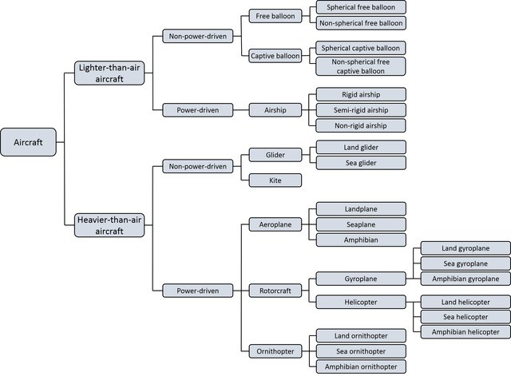

# Air Law {#airlaw}

## International law conventions agreements and organizations

### International Law

-   no international law enforcement
-   States required to ratify agreed conventions into national law

THERE WAS MORE CHECK AND EXPAND

### ICAO

International Civil Aviation Organisation

-   created in 194x, established after ratification
-   became specialised organisation of United Nations

Organisation of ICAO

-   bodies ... air transport, air navigation, ...

Freedomes of the air

-   elaborate on the various freedoms

ICAO Annexes

Annex Subject 1 Personnel Licensing (Getting a license is my Number 1
priority) 2 Rules of the Air (2 Sets of Rules, VFR and IFR) 3
Meteorological Services (3ºC/1000ft DALR or 1deg/100m) 4 Aeronautical
Charts (4 Cardinal Points) 5 Dimensional Units (CRP 5) 6 Operation of
Aircraft (DC6) 7 Nationality and Registration Marks (The League of Seven
Nations) 8 Airworthiness (Looks like a propeller) 9 Facilitation (NEIN
in German -- Immigration) 10 Aeronautical Communications (100 for the
Operator) 11 Air Traffic Control Services (1 to 1 Personal Services) 12
Search & Rescue (The one before Accident Investigation) 13 Accident
Investigation (Unlucky for some) 14 Aerodromes (14 Aerodromes around
Heathrow) 15 Aeronautical Information Services (Looks like IS) 16
Environmental Protection (16 Age of Consent, use protection) 17 Security
(17ft security fence required) 18 Dangerous Goods (At 18 you can drink
but it's DANGEROUS to drive)

### EASA

European Aviation Safety Agency

### IATA

International Air Transport Associated

### EUROCONTROL

European Organisation for the Safety of Air Navigation

## Flight Crew Licensing

"please refer to part FCL" :)

## Rules of the Air

### Terms and Definitions

a good set / mix of definitions ranging from IFR/VFR IMC/VMC,
services/units, controlled flight, aerodrome terms, airspace classes.

IDEA: REWORK AND DEVELOP SUBSECTION TO ALIGN/DIFFERENTIATE BETTER.

Note: Automatic dependent surveillance (ADS) is "emphasised" with
introducing ADS agreement and contract at the beginning of the list of
defintions.

### Rules of the Air

Applicability The rules of the air shall apply to aircraft bearing the
nationality and registration marks of a Contracting State, wherever they
may be, to the extent that they do not conflict with the rules published
by the State having jurisdiction over the territory overflown.

over high seas: (unless notified differently) appropriate ATS authority
= as designated by the State assuming to provide services under a
regional air navigation agreement.

Compliance with the rules of the air\
The operation of an aircraft either in flight or on the movement area of
an aerodrome shall be in compliance with the general rules and, in
addition, when in flight, either with:a) the visual flight rules or b)
the instrument flight rules

Responsibility of pilot-in-command\
The pilot-in-command of an aircraft shall, whether manipulating the
controls or not, be responsible for the operation of the aircraft in
accordance with the rules of the air,\
except\
that the pilot-in-command may depart from these rules in circumstances
that render such departure absolutely necessary in the interests of
safety.

Preflight action for flights away from vicinity of aerodrome and all IFR
- current weather reports and forecasts - fuel requirements\
- alternate course of action, if flight cannot be completed as planned.

Authority\
The pilot-in-command of an aircraft shall have final authority as to the
disposition of the aircraft while in command.

No person whose function is critical to the safety of aviation
(safety-sensitive personnel) shall undertake that function while under
the influence of any psychoactive substance, by reason of which human
performance is impaired.\
No such person shall engage in any kind of problematic use of
substances.

#### General Rules

AVODING COLLISIONS

-   proximity - no operations in such proximity as to create collision
    hazards

-   right-of-way -

    -   right of way a/c to maintain heading and speed unless PIC
        collision avoidance

    -   a/c giving way: no passing over, under, in front, unless well
        clear and considering effect of wake turbulences

    -   head-on: both aircraft alter heading to the right

    -   converging (same level) a/c having the other on their right to
        give way ("Rechts-vor-Links") with the exception

        -   

            a)  power-driven heavier-than-air aircraft shall give way to
                airships, gliders and balloons;

        -   

            b)  airships shall give way to gliders and balloons;

        -   

            c)  gliders shall give way to balloons;

        -   

            d)  power-driven aircraft shall give way to aircraft which
                are seen to be towing other aircraft or objects.

    -   overtaking: from behind within 70deg / no view of position
        lights at night, to the right and stay clear (climb, descent,
        same level) until entirely past and clear (including changes by
        the a/c overtaken)

    -   a/c in flight or on ground/water give way to a/c landing or in
        final stages of approach

        -   in case of simultaneous approaches: higher aircraft to give
            way to lower a/c
        -   power-driven a/c give way to gliders

    -   emergency landing

    -   taxiing aircraft give way to a/c taking off or about to take off

    -   surface movement: head on = stop, as appropriate of both to the
        right, converging: a/c from right has right of way/other give
        way, overtaking: a/c to be overtake has right of way, other to
        stay clear

FOMRATION FLYING

-   1km laterally and longitudinally and 30m vertically from the flight
    leader
-   no formation flight except by "pre-arrangement" among PICs

TAXIING FLIGHTS

An aircraft taxiing on the manoeurvring area shall stop and hold at all
runway-holding positions unless otherwise authorized by the aerodrome
control tower.\
An aircraft taxiing on the manoeuvring area shall stop and hold at all
lighted stop bars and may proceed further when the lights are switched
off

LIGTHS

-   in flight from sunset to sunrise or any other period prescribed by
    appropriate authority

    -   anti-collision lights intended to attract attention of other
        aircraft
    -   navigation lights indicated to signal the relative path of the
        aircraft
    -   no other lights if they are likely to be mistaken

-   moving aircraft on movement area shall dispaly navigation lights
    signalling relative path & no other lights if to be mistaken

-   unless stationary and adequately illuminated aircraft shall display
    lights that to indicate the extremeties\

many clauses: basically operate anti-collision lights (attracting
attention) at all times (outside sunset to sunrise) on movement area or
in flight

Lights can be switched off or lowered in intensity by pilot if \*
adversely affect the satisfactory performance of duties; or \* subject
an outside observer to harmful dazzle.

MINIMUM HEIGHTS

Except when necessary for take-off or landing, or except by permission
from the appropriate authority, aircraft shall not be flown over the
congested areas of cities, towns or settlements or over an open-air
assembly of persons, unless at such a height as will permit, in the
event of an emergency arising, a landing to be made without undue hazard
to persons or property on the surface.

VFR \* over the congested areas of cities, towns or settlements or over
an open-air assembly, NOT less than 300 m (1000 ft) within a radius of
600 m of the highest obstable; \* elsewhere other: NOT less than 150 m
(500 ft) over ground/water

IFR \* except for take-off, landing, or specifically authorised, an IFR
flight shall be flown not below the minimum flight altitude established,
or - if such miniumum is not established - \* over high terrain or in
mountainous areas, at a level which is at least 600 m (2.000 ft) above
the highest obstacle located within 8 km of the estimated position of
the aircraft \* Elsewhere than as specified above, at a level which is
at least 300 m (1.000 ft) above the highest obstacle located within 8 km
of the estimated position of the aircraft.

CRUISING LEVELS

-   Flight levels, for flights at or above the lowest usable flight
    level or, where applicable, above the transition altitude;
-   Altitudes, for flights below the lowest usable flight level or,
    where applicable, at or below the transition altitude

SIMULATED INSTRUMENT FLIGHTS

An aircraft shall not be flown under simulated instrument flight
conditions unless:

-   fully functioning dual controls are installed in the aircraft
-   a qualified pilot occupies a control seat to act as safety pilot for
    the person who is flying under simulated instrument conditions. The
    safety pilot shall have adequate vision forward and to each side of
    the aircraft,\
-   or a competent observer in communication with the safety pilot shall
    occupy a position in the aircraft from which the observer's field of
    vision adequately supplements that of the safety pilot.

OPERATION IN VINCINITY OF AN AERODROME

aircraft on or in vincinity of an aerodrome shall - whether or not
within the aerodrome traffic zone

-   observe other aerodrome traffic for the purpose of avoiding
    collision;
-   conform with or avoid the pattern of traffic formed by other
    aircraft in operation;
-   make all turns to the left, when approaching for a landing and after
    taking off, unless otherwise instructed;
-   land and take off into the wind unless safety, the runway
    configuration, or air traffic considerations determine that a
    different direction is preferable.

## Signals

-   distress and urgency signals
-   signals for use in event of an interception
-   visual signals used to warn an unauthorised aircraft flying in, or
    about to enter a Restricted, Prohibited, or Danger Area
-   signals for aerodrome traffic, and
-   marshalling signals

### Distress Signals

The following signals - used either together or separately - mean that
grave and imminent danger threatens and immediate assistance is
requested:

-   RT or other signalling method SOS ...---...
-   RT spoken word MAYDAY
-   distress message sent via data link transmitting intent of the word
    MAYDAY
-   rockets or shells throwing red lights, fired one at a time at short
    intervals
-   parachute flame showing red light

Art 41 ITU Radio Regulations: alarm signals for RT adn RT auto-alarms
systems

-   RT alarm signals consists of a series of 12 dashes sent in 1 minute,
    each dash 4 seconds, interval between consecutive dashes 1 second.
    Transmitted by hand, but automated instrument recommended.

-   RT alarm signal consists of 2 substantially sinusoidal audio
    frequency tones transmitted alternately. One tone shave have
    frequence of 2.200 Hz and the other 1.300 Hz. Duration of each tone
    250 miliseconds (0,25 seconds \~1/4 sec)

-   RT alarm signal

    -   when generated automatically shall be sent continuously for a
        period of at least 30 seconds, but not exceeding 1 minutes
    -   when generated by other means, the signal shall be sent as
        continously as practicable over a period of approximately 1
        minute

### Urgency Signals

The following signals - used either together or separately - mean that
an aircraft wishes to give notice of difficulties which compel it to
land without requiring immediate assistance:

-   repeated switching on and off of the landing lights; or
-   repeated switching on and off of the navigatio lights in such a
    manner as to be distinct from flashing navigation lights.

The following signals - used either together or separately - mean that
an aircraft has a very urgent message to transmit concerning the safety
of a ship, aircraft, or other vehicle, or of some person on board or
within sight:

-   RT or other signalling method consisting of the group XXX ()
-   RT urgency signal spoken word PAN-PAN
-   urgency message sent via data link transmitting intent of the words
    PAN,PAN.

### Interception Signals

check table and put here.

### Warning Signals for unauthorised aircraft flying in, or about to enter a Restricted, Prohibited, or Danger Area

By day and night

-   series of projectiles discharged from the ground at intervals of 10
    seconds
-   each showing - on bursting - red and green lights or stars

= aircraft in or about to enter Restricted, Prohibited, or Danger Area =
aircraft to take remedial action as may be necessary (i.e. leave/stay
clear)

### Signals for Aerodrome Traffic

in flight

-   pyrotechnic red - notwhithstanding any previous instruction, do not
    land for the time being
-   steady red - (STOP) give way to other aircraft and continue circling
-   green flashes - return for landing
-   red flashes - aerodrome unsafe - do not land (hush away)
-   white flashes - land at this aerodrome and proceed to apron
-   steady green - (GO) cleared to land

on ground

-   steady read - STOP (aka hold and give way)
-   red flashes - (hush away) taxi clear of landing area in use
-   green flashes - cleared to taxi
-   white flashes - return to starting point on the aerodrome
-   steady green - (GO) cleared for take-off

acknowledgement by aircraft

in flight

-   during hours of daylight: rocking aircraft's wings (note: not on
    base and final legs)
-   during hours of darkness: flashing on and off TWICE aircraft's
    landing lights or - if not so equipped - by switching on and off
    TWICE its navigation lights.

on ground

-   during hours of daylight: moving aircraft's ailerons or rudder
-   during hours of darkness: flashing on and off TWICE aircraft's
    landing lights or - if not so equipped - by switching on and off
    TWICE its navigation lights.

### Marshalling Signals

check for guide and add

## Air Traffic Control Service

### Clearances

An air traffic control clearance shall be obtained prior to operating a
controlled flight, or a portion of a flight as a controlled flight. Such
clearance shall be requested through the submission of a flight plan to
an air traffic control unit.

Note 1 - A flight plan may cover only part of a flight, as necessary, to
describe that portion of the flight or those manoeuvres which are
subject to air traffic control. A clearance may cover only part of a
current flight plan, as indicated in a clearance limit or by reference
to specific manoeuvres such as taxiing, landing or taking off.

Note 2- If an air traffic control clearance is not satisfactory to a
pilot-in-command of an aircraft, the pilot-in command may request and,
if practicable, will be issued an amended clearance

Priority

Whenever an aircraft has requested a clearance involving priority, a
report explaining the necessity for such priority shall be submitted, if
requested by the appropriate air traffic control unit. Power driven
heavier than air aircraft shall give way to airships, gliders and
balloons.

Potential reclearance in flight

If prior to departure it is anticipated that depending on fuel endurance
and subject to reclearance in flight, a decision may be taken to proceed
to a revised destination aerodrome, the appropriate air traffic control
units shall be so notified by the insertion in the flight plan of
information concerning the revised route (where known) and the revised
destination.

An aircraft operated on a controlled aerodrome shall not taxi on the
manoeuvring area without clearance from the aerodrome control tower and
shall comply with any instructions given by that unit.

Termination of Control

A controlled flight shall, except when landing at a controlled
aerodrome, advise the appropriate ATC unit as soon as it ceases to be
subject to air traffic control service

### Communications

aircraft operated as controlled flight shall

-   maintain continuous air graound voice communiction watch on the
    appropriate communication channel of
-   establish two-way communication as necessary with the appropriate
    ATS authority in respect of aircraft forming part of aerodrome
    traffic at a controlled aerodrome (and elsewhere?)

SELCAL or similar automatic signalling devices = satisfactory device to
maintain air-ground voice communication watch

Despite CPDLC, aircraft to maintain air-ground voice communication watch

COMMUNICATION FAILURE

in case of COM failure and/or failing to meet gen requirement, aircraft
to comply with voice communication failure procedure of Annex 10, Vol
II, AND

-   shall attempt to establish communication with appropriate ATC unit
    using all other available means
-   within aerodrome traffic at controlled aerodrome: keep watch for
    instructions by visual signals

in VMC, the aircraft shall

-   continue VMC
-   land at next suitabel aerodrome
-   report arrival by the most expeditious means to appropriate ATC unit
-   if considered advisable, complete an IFR flight if in IMC

In IMC or when pilot of IFR flight considers it inadvisable to land at
the nearest suitable aerodreom, the aricraft shall

-   unless otherwise prescribed on the basis of national air navigation
    agreement, in airspece where radar is not used, maintain the last
    assigned speed and level, or minimum flight altitude (if higher),
    for 20 minutes following the aircraft's failure to report its
    position over a compulsory reporting point and thereafter adjust
    level and speed in accordance with the filed flight plan.

-   in airspace where radar is used, maintain the last assigned speed
    and level, or minimum flight altitude - if higher - for a period of
    7 minutes following

-   the time the last assigned level or minimum altitude is reached; or

-   the time the transponder is set to Code 7600; or

-   airfraft's failure to report its position over a compulsory
    reporting point

-   whichever is later - and thereafter adjust level and speed in
    accordance with the last filed flight plan.

when being radar vectored or having been directed by ATC to proceed
offset using RNAV without a specified limit, rejoin the current flight
plan route no later than the next significant point, taking into
consideration the applicable minimum flight altitude.

proceed according to the current flight plan route to the appropriate
navigation aid or fix serving the destination aerodrome and - when
required to ensure compliance with e.) below - hold over this aid or fix
until commencement of descent

commence descent from NAV aid or fix - specified above d) - at, or as
close as possible to, the expected approach time last received and
acknowledged, or if no expected approach time has been received and
acknowledged, at, or as close as possible to , the estimated time of
arrival resulting from the current flight plan.

complete a normal instrument approach procedure as specified for the
designated navigation air or fix, and (g) land, if possible whtin 30
minutes after the estimated time of arrivale specified in (e) or the
last acknowledged expected approach time - whichever is later.

??? A commander should transmit special aircraft observations when he
encoutern

-   moderate turbulence, hail, or CB clouds during supersonic or
    transonic flight;
-   other conditions that the commander considers may effect the safety
    of other aircraft
-   severe turbulence or icing.

### Visual Flight Rules

TODO - check for figure or turn this into visual

Except when operating as a Special VFR flight, VFR flights shall be
conducted so that the aircraft is flown in conditions of visibility and
distance from clouds equal or greater than those specified

-   at and above 3050m/10000ft AMSL, in airspace ABCDEFG, vis: 8 km,
    1500 horizontally and 300m/1000ft vertically

-   below 3050m/10000ft and above 900m/3000ft AMSL or above 300m/1000ft
    above terrain - whichever is higher, in airspace ABCDEFG: vis: 5km,
    1500m horizontally & 300m/1000ft vertically)

-   at and below 900m/3000ft AMSL, or 300m/100ft about terrain -
    whichever is higher

    -   in airspace ABCDE: vis 5km, 1500m horizontally, 300m/1000ft
        vertically
    -   in airspace FG : vis 5km, clear of clouds and GND in sight

If TA is lower than 3050m/10000ft, FL 100

Note: VMC minima for airspace A are given for guidance. They do not
imply acceptance of VFR flights in Class A airspace.

Except when a clearance is obtained by ATC, VFR flights shall not take
off or land at an aerodrome within a control zone CTR, or enter the
aerodrome traffic zone or traffic pattern

-   when ceiling is less than 450m/1500ft or
-   ground visibility less than 5km

VFR flight between sunset and sunrise - or such other period between
sunset and sunrise as may be prescribed by appropriate ATS authority -
shall be operatored in accordance with the conditions prescribed by such
authority.\
Unless authorised by appropriate ATS authority, VFR flights shall NOT be
operated

-   above FL200
-   at transonic and supersonic speeds

Authorisation for VFR flights to operate above FL290 shall not be
granted in areas where a vertical separation minimum of 300m/1000ft is
applied above FL290, except when necessary for take-off or landing; or
by permission from appropriate authority, a VFR flight shall NOT be
flown

-   over congested areas of cities, towns, or settlements or over an
    open-air assembly or persons at a height less than 300m/1000ft above
    the highest obstacle within a radius of 600m;
-   elsewhere, at a height of less than 150m/500ft above ground or
    water.

Except where otherwise indicated in ATC clearance or specified by
appropriate ATS authority, VFR flights in level cruising flight when
operated above 900m/3000ft from ground or water, or a higher data as
specified by appropriate ATS authority, shall be conducted at the
appropriate flight level.

VFR flight shall comply with the provisions of ATC service \* when
operated whithin airspace classes B, C, and D \* forming part of
aerodrome traffic at controlled aerodromes, or \* when operated as
special VFR (SVFR).

VFR flights operating within ... lalala ...shall maintain air-ground
voice communication watch on he appropriate communication channel of,
and report its position as necessary to, the air traffic services unit
providing FIS.

Notes: SECAL ok, voice watch even in CPDLC

An aircraft operated in accordance with VFR rules which wishes to change
to compliance with IFR rules shall

-   if a flight plan was submitted, communicate the necessary changes to
    be effected to its current flight plan; or
-   when so required, submit a flight plan to the appropriate air
    traffic services unit and obtain clearance prior to proceeding IFR
    when in controlled airspace.

### Instrument Flight Rules (IFR)

aircraft shall be equipped with suitable instruments and with navigation
equipment appropriate to the route to be flown.

MINIMUM LEVELS

Except for take-off or landing, or except when specifically authorised
by appropriate authority, an IFR flight shall be flown at a level which
is not below the minimum flight altitude established by the State whose
territory is overflown, or, where no such minimum flight altitude has
been established

-   over high terrain or in mountainous areas, at a level which is at
    least 600m/2000ft above the highest obstacle located within 8km of
    the estimated position of the aircraft;
-   elsewhere at a level which is at least 300m/1000ft above the
    higherst obstacle located within 8km of the estimated aircraft
    position.

The estimated aircraft position will take account of the navigational
accuracy .. nav facilities and aircraft

CHANGE IFR to VFR

IFR to VFR: if flight plan was submitted, notify appropriate ATS unit
specifically that IFR flight is cancelled and communicate thereto the
changes to be made to its current flight plan.

aircraft under IFR in VMC it shall not cancel its IFR flight unless it
is anticipated and intended that the flight will be continued for a
reasonable period of time in uniterrupted VMC.

IFR WITHIN CONTROLLED AIRSPACE

IFR flight shall comply with the provisions of ATC service when operated
in controlled airspace.

IFR in controlled airspace shall be flown at cruising level or - if
authorised to employ cruise climb techniques - between 2 flight levels
or above a level selecting from

-   tables of cruising levels; or
-   a modified table of clruising levels, when prescribed, for flights
    above FL410;
-   except when otherwise indicated in ATC clearances or specified by
    appropriate ATS authority in AIP.

RULES APPLICABLE TO IFR OUTSIDE CONTROLLED AIRSPACE

Cruising Levels\
IFR operating in level cruising outside of controlled airspace shall be
flown at cruising level appropriate to its track as specified in

-   tables of cruising levels, except when otherwise specified by the
    appropriate ATS authority for flight at or below 900m/300ft above
    MSL; or
-   a modified table of cruising levels for flights above FL410.

COMMUNICATIONS

IFR outside controlled airspace but within areas or routes requiring
FIS, Alerting and SAR, or coordination civ/mil to avoid interception &
support identification, shall maintain air-ground voice communication
watch on the appropriate communication channel and establish 2-way
communication - as necessary - with ATS unit providing FIS.

POSITION REPORTS

IFR outside controlled airspace and required by appropriate ATS
authority shall

-   submit flight plan
-   maintain air-ground voice communication watch on appropriate channel
    and establish 2-way communication with ATSU providing FIS

Unless exempted, a controlled flight shall report time and level of
passing each designated compulsory reporting point together with any
other required information.\
Position reports shall similarly made in relation to additional points
when requested by the ATSU.\
In the absence of designated reporting points, position reports shall be
made at intervals prescribed by appropriate ATS authority or specified
by ATSU.\
Controlled flights providing position reports to appropriate ATSU by
data link shall only provide voice positio reports when requested.

TO-Do - cruising level tables

### Interception of Civil Aircraft

When intercepted, pilot in command shall comply with the appropriate
standards, interpreting and responding to visual signals as specified.

PRINCIPLES TO BE OBSERVED BY STATES

-   interception of civil aircraft will be undertaken only as a last
    resort;
-   interception limited to determining the identity of the aircraft,
    unless it is necessary to return the aircraft to its planned track,
    direct it beyond boundaries of national airspace, guide it away from
    a prohibited, restricted, or danger area, or instruct it to effect a
    landing at a designated aerodrome;
-   practice interception of civil aircraft will not be undertaken;
-   navigational guidance and related informatio will be given to an
    intercepted aircraft by RT whenever radio contact can be
    established; and
-   in case where an intercepted civil aircraft is required to land in
    the territory overflown, the aerodrome designated for the landing is
    suitable for the safe landing of the airfraft type concerned.

ACTION BY INTERCEPTED AIRCRAFT

aircraft intercepted by another aircraft shall immediately

-   follow the instructions given by the intercepting aircraft,
    interpreting and responding to the visual signals;
-   notify - if possible - the appropriate ATSU
-   attempt to establish radio communication with the intercepting
    aircraft or with the appropriate intercept control unit, by making a
    general call on the emergency frequency 121,5 MHz, giving the
    identity of the intercepted aircraft and the nature of the flight,
    and - if no contact has been established and if practible -
    repeating this call on the emergency frequence 243 MHz;
-   if equipped with SSR, select mode A, Code 7700, unless otherwise
    instructed by ATSY.

If RT instructions conflict with signals from intercepting aricraft by
visual signs, request clarification while complying with visual
instructions.

If RT instructions conflict with those given by intercepting aircraft,
request clarification while comply with instructions from intercepting
aircraft.

TODO CHECK SIGNAL AND PHRASEOLOGY

UNLAWFUL INTERFERENCE

Unless situation dictates otherwise, attempt to continue flying assigned
track and level until able to notify ATS unit

If forced to deviate without being able to contact ATS

-   attempt to broadcast warnings on VHF emergency frequency or
    appropriate, unless situation prohibits

-   follow specific procedure established and promulgated in Regional
    Supplemental Procedures; or

-   no applicable procedures are established, contine with a level
    different from cruising leven under IFR by

    -   150m/500ft where vertical sep minima 300m/1000ft
    -   300m/1000ft were 600m/2000ft

# Air Traffic Control - Services and Management

Whole bunch of definitions -- TODO: groups and package

## Services

**Air traffic service** is a generic terms meaning variously

-   air traffic control service;
-   air traffic advisory service;
-   flight information service;
-   alerting service

An air traffic control service is provided for the purpose of

-   preventing collisions between aircraft in the air
-   assisting in preventing collisions between aircraft moving on the
    apron and the manoeuvring area
-   assisting in preventing collisions between aircraft and obstructions
    on the manoeuvring area
-   expediting and maintaining an orderly flow of air traffic.

Air traffic control service is provided according to the particular
circumstances and class of airspce. It may comprise [*one or more*]{.ul}
of the following

-   aerodrome control service

-   approach control service - with or without the aid of radar

-   area control service - with or without the aid of radar.

**Air traffic advisory service** is provided for the same purpose as air
traffic control service for participating aircraft flying outside
controlled airspace (:= uncontrolled airspace). The service is delivered
in the same way and pilots are expected to comply unless they state
otherwise.

**Radar advisory service**: where available, radar may be used to assist
in providing services to aircraft flying in Class F and Class G airspace
(:= uncontrolled airspace).

### Flight Information Service

Flight information service (FIS) is a non-radar service provided, either
separately or in conjunction with other services, for the purpose of
supplying information useful for the safe and efficient conduct of
flights.

Under FIS the following conditions apply:

-   provision of service includes information about weather, changes of
    serviceability of facilities, conditions at aerodromes, and any
    other information pertinent to safety.

-   controller may attempt to identify the flight for monitoring and
    coordination purposes only.\
    Such identification does not imply that a radar service is being
    provided or that the controller will continuously monitor the
    flight.\
    Pilot must be left in no doubt that they are not receiving a radar
    service.

-   controllers are not responsible for separating or sequencing of
    aircraft.

In addition, controllers will - subject to wordload - provide pilots
with information concerning collision hazards to aircraft operating in
airspace Class C, D, E, F, or G when selfevident information from any
source indicates that a risk of collision may exist. It is accepted that
this information may be incomplete and the contoller cannot assume
responsibility for its issuance at all times or for its accuracy.

## Classification of Airspace

Classification of airspaces within a FIR determines the flight rules and
minimum services.

+--------+--------------+---------------------+---------------------+
| Cl ass | Flight Rules | Aircraft            | Minimum Services by |
|        |              | Requirements        | ATC Unit            |
+========+==============+=====================+=====================+
| A      | IFR only     | -   ATC clearance   | separate all        |
|        |              |     before entry    | aircraft from each  |
|        |              |                     | other               |
|        |              | -   comply with ATC |                     |
|        |              |     instructions    |                     |
+--------+--------------+---------------------+---------------------+
| B      | IFR and VFR  | -   ATC clearance   | separate all        |
|        |              |     before entry    | aircraft from each  |
|        |              |                     | other               |
|        |              | -   comply with ATC |                     |
|        |              |     instructions    |                     |
+--------+--------------+---------------------+---------------------+
| C      | IFR and VFR  | -   ATC clearance   | -   separate IFR    |
|        |              |     before entry    |     from other IFR  |
|        |              |                     |     and VFR         |
|        |              | -   comply with ATC |                     |
|        |              |     instructions    | -   separate VFR    |
|        |              |                     |     from IFR        |
|        |              |                     |                     |
|        |              |                     | -   pass traffic    |
|        |              |                     |     info to VFR on  |
|        |              |                     |     other VFR and   |
|        |              |                     |     give traffic    |
|        |              |                     |     avoidance       |
|        |              |                     |     advice, if      |
|        |              |                     |     requested       |
+--------+--------------+---------------------+---------------------+
| D      | IFR and VFR  | -   ATC clearance   | -   separate IFR    |
|        |              |     before entry    |     from IFR        |
|        |              |                     |                     |
|        |              | -   comply with ATC | -   pass traffic    |
|        |              |     instructions    |     info to IFR on  |
|        |              |                     |     VFR and give    |
|        |              |                     |     traffic         |
|        |              |                     |     avoidance       |
|        |              |                     |     advice, if      |
|        |              |                     |     requested       |
|        |              |                     |                     |
|        |              |                     | -   pass traffic    |
|        |              |                     |     info to VFR on  |
|        |              |                     |     IFR and other   |
|        |              |                     |     VFR flights     |
+--------+--------------+---------------------+---------------------+
| E      | IFR and VFR  | -   IFR flights     | -   separate IFR    |
|        |              |     clearance       |     from IFR        |
|        |              |     before entry    |                     |
|        |              |     and comply with | -   pass traffic    |
|        |              |     ATC             |     info as far as  |
|        |              |     instructions    |     practicable to  |
|        |              |                     |     IFR on VFR      |
|        |              | -   VFR flights do  |                     |
|        |              |     not require     | -   VFR flights in  |
|        |              |     clearance       |     contact:        |
|        |              |                     |     traffic info as |
|        |              |                     |     far as          |
|        |              |                     |     practicable     |
+--------+--------------+---------------------+---------------------+
| F      | IFR and VFR  | participating IFR   | separate            |
|        |              | flights are         | participating IFR   |
|        |              | expected to comply  | lights from each    |
|        |              | with ATC            | other               |
|        |              | instructions        |                     |
+--------+--------------+---------------------+---------------------+
| G      | IFR and VFR  | non                 | none                |
+--------+--------------+---------------------+---------------------+

: airspace classes

### Visual Flight Rules

pilot responsible for determining whether or not the meteorological
conditions permit flight in accordance with VFR.

TODO - add table with minima

### Instrument Flight Rules

pilot must fly IFR:

-   airspace Class A;

-   meteorological conditions preclude VFR

IFR require a pilot to observe the minimum height rule and additional
rules according to airspace

-   within controlled airspace (Class A, B, C, D, and E)

    -   file flight plan and obtain clearance before proceeding with the
        flight

    -   conduct flight in accordance with clearances and instructions
        from air traffic control

    -   maintain listening watch on the appropriate radio frequencies;

    -   report position of the aircraft according to published
        procedures.

-   outside controlled airspace (Class F and G)

    -   comply with quandrantal rule when in level flight above 3000ft
        MSL; altimeter set to 1013,2mb/hPA; cruising level selected
        according to magnetic track unless the aircraft is holding
        according to published procedures or is otherwise instructed by
        air traffic control

quandrantal rule: IFR flights outside controlled airspace below FL245

0 \<= magnetic track \< 90: FL30, 50, 70 ... 230

90 \<= mag. track \< 180: FL35, 55, 75, ... 235

180\<= mag.track \< 270: FL40, 60, 80, .... 240

270 \<= mag.track \< 360: FL45, FL64 ... FL225

### Aerodrome Traffic Zones

Aerodrome traffic zones are not allocated to a specific class of
airspace - they adapt the class of airspace within which they are
situated.

Aircraft within aerodrome traffic zone are subject to Rules of the Air
in addition to the specific conditions of the airspace.

At aerodromes with ATC unit (:= controlled aerodrome), all movements are
subject to the permission of that unit. Aircraft will comply with
instructions given by RT and maintain listening watch. Non-radio
aircraft which have been given prior permission to fly within the zone,
will comply with visual signals.

Controllers are to provide air traffic control service to aircraft
within an aerodrome traffic zone and to aircraft under their
jurisdiction in the vicinity of the aerodrome.

### Special VFR

Special VFR when requested by pilot or when it is notified in the AIP
for a particular type of operatoin. Before issuing such a clearance a
controller must consider the prevailing traffic conditions, the extent
of the proposed flight, and the availability of air/ground
communications.

Special VFR are not to hinder normal IFR flights\\.

Pilot of SVFR flight

-   must comply with ATC instructions;

-   is responsible for ensuring that the flight conditions enable him to
    remain clear of clouds, determine his flight path with reference to
    surface, and keep clear of obstructions;

-   is responsible for ensuring that he flies within the limitations of
    his license;

-   is responsible for complying with the relevant flying restrictions;

-   is responsible for avoiding aerodrome traffic zones unless prior
    permission for penetration has been obtained from the relevant air
    traffic control unit.

### Air Traffic Control Services

provided by Flight Information Centres (FICs) and Air Traffic Control
Units(ATCUs).

FICs provide flight information service and alerting service within FIR
unless this is assigned to ATC Unit (having adequate facilities to
discharge the responsibility).

ATCU provide ATC service, FIS, and Alerting Service within CTAs and CTRs
and at controlled aerodromes.

### Flight Information Region

FIR is an airspace with specific dimensions in which Flight Information
Servue and Alerting Service are provided.

FIR := largest regular division of airspace.

Any portion of globe/atmosphere assigned to a specific FIR. Larger
countries / multiple FIRs. Oceanic airspace \~ Oceanic Information
Regions \~ service provision delegated to controlling authority border
that region. Division / delegation via international agreement through
ICAO.

FIR \~ no standard size/dimension \~ administrative organisation.

Boundaries of FIR either agreed by common consent between states or by
strict adherence to national borders (:= territory).

Horizontal division possible: lower portion FIR, upper airspace UIR
Upper Information Region.

FL660 is the vertical limit of controlled airspace agreed
internationally.

### CTA - Control Area

Check and expand ... lower limit not less than 200m/700ft. Upper limit
typically FL245 or upper CTA.

### UIR / Upper Control Areas

may expand over multiple FIRs ... no interference from aircraft joining
an airway climbing or descending to and from aerodromes.

### CTRs

CTRs encompass thoses parts of the airspace of a FIR which are not
within Control Areas CTAs and which contain flight paths of IFR flights
arriving and departing from aerodromes which can used in IMS.

ATC authority for a CTR can be APP at an aerodrome or a dedicated office
within an ACC with responsibility solely for the CTR.

CTR must have defined upper limit, extends from ground to a defined
altitude or Flight Level. CTR completely under CTA, upper limit of CTR
== lower limit of CTA.

Lateral limits of CTR must extend at least 9.3km/5NM from the centre of
the aerodrome, or aerodromes concerned in the directions from which the
approaches may be made.

CTR may include several aerodromes situated close together.

### Identification

An area controll center is identified by the name of a nearby town or
another geographic feature. An aerodrome control tower or approach
center is known by the name of the aerodrome. A CTR, CTA, or FIR is
identified by the name of the unit having jurisdiction over the
airspace.

## Air Traffic Route Structure

TO BE CONTINUED - FILLED IN

# Volume 2

## Airworthiness

The Airworthiness standards of Annex 8 of the Chicago Convention are
related to the Standards of Annex 6, Part I dealing with aeroplane
performance operating limitations.

An element of the safety of an operation is the instrinsic safety of the
aircraft. That is the level of its airworthiness. The level of
airworthiness of an aircraft is not fully defined by the application of
the Airworthiness Standards of Annex 8, but also requires the
application of the Standards of Annex 6. We can say that Annex 8 deals
with airworthiness from the engineering point of view, whereas Annex 6
deals with the safety standards necessary for any operation.

The Standards of Airworthiness, detailed in Annex 8 Part 3 are
applicable to aeroplanes with a MTOM of more than 5.700kg and which are
intended for the transport of passengers, cargo or mail in international
air transport. Unless specifically exempted, the standards apply to the
complete aeroplane including power units, systems and equipment.

For European Union: EASA has established applicable airworthiness
standards.

diagram of regulation/airworthiness organisation

## Certificate of Airworthiness - ICAO Annex 8 Chapter 3

issued by the State of registration when satisfactory evidence is
provided that the aeroplane complies with the appropriate airworthiness
requirements.

aircraft with valid CA of another state register of another state, the
new state of registry may consider CA as evidence in whole or in part
when issuing another CA or rendering original CA valid

validity of authorisation shall not be extended beyond validity of CA
(?) (what authorisation?)

Standard Form (ICAO)

-   nationality and registration marks

-   manufacturer and manufacturer's designation of aircraft

-   aircraft serial number

-   categories (?)

-   date/signature

-   (periodic endoresement)

## Continuing Airworthiness - ICAO Annex 8 Chapter 4

The state of registry is responsible for determining if an aircraft
continues to be airworthy. The state is required to maintain a system
for recording faults, malfunctions, defects or other occurrences which
might affect the airworthiness of aircraft of more than 5.700kg MTOM.

The State of Registry shall ensure that in respect of aeroplanes of over
5.700 kg and helicopters over 3.180 kg maximum certificated take-off
mass, there exists a system whereby information on faults, malfunctions,
defects and other occurrences that cause or might cause adverse effects
on the continuing airworthiness of the aircraft is transmitted to the
organization responsible for the type design of that aircraft.

The State of Design shall ensure that in respect of aeroplanes over 5
700 kg maximum certificated take-off mass, there exists a continuing
structural integrity programme to ensure the airworthiness of the
aeroplane. The programme shall include specific information concerning
corrosion prevention and control

The State of Design of an aircraft shall transmit any generally
applicable information which it has found necessary for the continuing
airworthiness of the aircraft and for the safe operation of the aircraft
to to every Contracting State which has advised the State of Design that
it has entered the aircraft on its register.

Each Contracting State shall establish, in respect of aeroplanes over
5.700 kg and helicopters over 3.180 kg maximum certificated take-off
mass, the type of service information that is to be reported to its
airworthiness authority by operators, organizations responsible for type
design and maintenance organizations. Procedures for reporting this
information shall also be established.

## Validity of Airworthiness Certificate

CA will be renewed or remain valid provided that continued airworthiness
has been determined by periodic inspection.

Inspection period dependent on service, elapsed period and system
established by State.

Damaged aircraft: state of registry to judge whether damage impair
airworthiness (no longer airworthy).

## Aircraft limitations and information

Each aircraft is required to have a flight manual or other means in
which the approved limitations are defined and additional information is
contained necessary for the safe operation of the aeroplane.

## Aircraft Nationality and Registration Marks

ICAO Paris Convention 1919 requires all aircraft to be registered and
carry nationality mark and registration mark.

Annex 7 of Chicago Convention: aircraft nationality and registration
marks. = standards (no recommendation == MUST).

Exemption from registration may be granted temporarily from the
appropriate authority for test flying or historic aircraft.

The nationality or common mark and registration mark shall consist of a
group of characters. The nationality or common mark shall precede the
registration mark. When the first character of the registration mark is
a letter it shall be preceded by a hyphen.

D-EAIP, OO-JMC

registration marks shall not use letters: 5 letter combinations used in
International Code of Signals, Part II (? never heard of this), 3-letter
Q-codes, distress signal SOS, other urgency signals, e.g. XXX, PAN, TTT.

Registration & nationality marks = painted on aircraft of affixed by
other means ensuring permanence. Marks shall be kept clean and visible
at all times.

## Register of Nationality, Common and Registration Marks

Each Contracting State or common mark registering authority shall
maintain a current register showing for each aircraft registered by that
State or common mark registering authority, the information recorded in
the certificate of registration.

The register of unmanned free balloons shall contain the date, time and
location of release, the type of balloon and the name of the operator.

## Certificate of Registration

The Nationality or Common mark

The registration mark

The manufacturer's designation of the aircraft

The serial number of the aircraft

The name and address of the owner

A certificate that it has been entered on the register of the State

The dated signature of the registering officer

The certificate is to be carried in the aircraft at all times

## Identification Plate

An aircraft shall carry an identification plate inscribed with at least
its nationality or common mark and registration mark.

fireproof/fireproofed material, affixed in prominent place/near
entrance;

in case of unmanned free balloon affixed conspicuously to the exterior
of the payload.

## Classification of aircraft

```{r}

```

BOOKDOWN EXAMPLE FOR ADDING CITATIONS\
You can write citations, too. For example, we are using the **bookdown**
package [@R-bookdown] in this sample book, which was built on top of R
Markdown and **knitr** [@xie2015].
