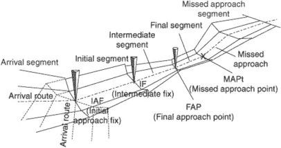
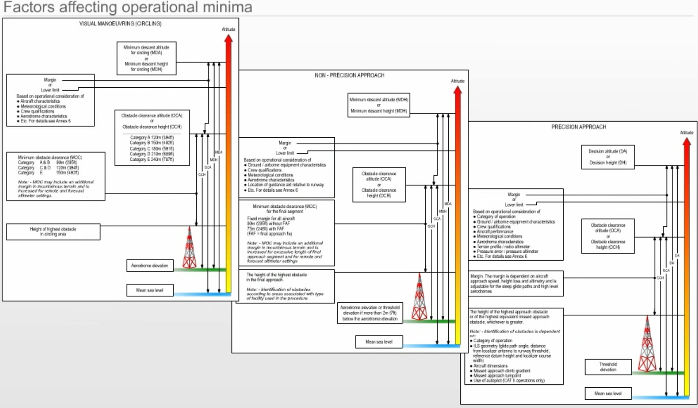

# Air Law 2

## Pan OPS - Procedures for Air Navigation - Aircraft Operations

PAN-OPS cover operational practices beyond SARPS but for which
international uniformity is "desirable"

-   Volumn I: flight procedures \
    operational procedures recommended for guidance of flight operatoins
    personnel and flight crew. Basis criteria for Volumn II, e.g.
    adherence to published procedures in order to achieve and maintain
    acceptable level of safety.

-   volume 2: construction of visual and instrument flight procedures \
    Guidance for procedure specialists - describes essential areas and
    obstacle clearance requirements for the achievement of safe, regular
    IFR operations. \
    Basic guidelines to States and those operators and organisations
    producing instrument flight charts for uniform practices at all
    airports where instrument flight procedures are carried out.

    Obstacle clearance is the primary safety consideration in the
    development of instrument flight procedures.

## Instrument Departure Procedures

To ensure acceptable clearance above obstacles during the departure
phase, instrument departure procedures may be published as

-   specific routes, or

-   omnidirectional departures, together with procedure design gradients
    and details of significant obstacles

1.  departure procedures assuming that all engines are operating

2.  wind effect: the procedure assumes that pilots will not compensate
    for wind effects when being radar vectored. Pilots will compensate
    for known or estimated wind effects when flying departure routes
    that are expresses as tracks to be made good.

3.  obstacle clearance: the minimum obstacle cleareance equals zero at
    the departure end of runway (DER). From that point it increases by
    0.8 percent of the horizontal distance in the direction of flight
    assuming a maximum turn of 15 degrees. In the turn initiation area
    or turn area, a minimum obstacle clearance of 295ft (90m) is
    provided.

4.  procedure design gradient (PDG): unless otherwise published a PDG of
    3.3% is assumed.

Contingency procedures, e.g. engine failure or emergency, occrring after
V1 are the responsibility of the operator (? unclear which one) in
accordance with Annex 6.\
Use of automatic take-off thrust control systems ATTCS and noise
abatement procedures need also to be taken into consideration by the
pilot and operator.

where obstacle cannot be cleared by the appropriate margins when flown
on instruments, airport operating minima are established to permit the
visual flight clear of obstacles.

wherever possible: straight departure aligned with the runway
centerline.

when a departure route requires a turn of more than 15 degrees to avoid
obstacle, a turning departure is constrcuted.

flight speeds for turning departure:

airplace category A max speed 225km/h (120kts), B 305km/h (165kts), C
490 Km/h (265kts), D 540 km/h (290kts), E 560 km/h (300kts), H 165km/h
(90kts)

Procedure Design Gradient

The PDG is intended as an aid to the procedure designer.

PDG based on

-   obstacle identificatio surface (OIS) having a 2.5% gradient or a
    gradient determines by the most critical obstacle penetrating the
    surface - whichever is higher, AND

-   an additional margin of 0.8%

Published gradients are specified to an altitude/height after which the
minimum gradient of 3.3% is considered to prevail.

The final PDG continues until obstacle clearance is ensured for the next
phase of flight (i.e. en-route, holding, or approach).

At this point, the departure procedure end is markes by a significant
point.

## Standard Instrument Departure (SID)

A SID is normally developed to accommodate as many aircraft categories
as possible. Departures that are limited to specific aircraft categories
are clearly annotated.

SID terminates at the first fix/facilyt/waypoint of the en-route phase
following the departure.

SID are based on track guidance acquired within

-   within 20 km (10.8NM) from the departure end of runway on straight
    departures; and

-   within 10 km (5.4NM) after completion of turns on depatures
    requiring turns.

Track guidance may be provided by a suitably located facility, e.g. VOR,
or by RNAV.

There are 2 basic types of SIDs:

-   straight departure: initial departure within 15 degree of runway
    center line

-   turning departure: departure requiring a turn of more than 15
    degrees. Straight flight is assumed until reaching an
    altitude/height of at least 120 m (394ft) [ or 90m (295ft) for
    helicopters). Procedures normally cater for turns at a point 600m
    from the beginning of the runway. However, in some cases, turns may
    not be initiated before the DER (or a specifed point), and this
    information will be noted on the departure chart.

## Omnidirectional departure

Omnidirectional departures are applied where no suitable navigation aid
is available.

Omnidirectional depatures may however specify sectors to be avoided.

## Area Navigation (RNAV) Departure Procedures

General principles of RNAV and RNP based approach procedures apply to
RNAV/RNP-based departures (WHICH ARE????)

Departures may be based on RNVA VOR/DME, RNAV DME/DME, basic GNSS or RNP
criteria. \
Most FMS-equipped aircraft are capable of following RNAV procedures
based on more than one of the above systems. However, in some cases the
procedure may speficy constraints on the system used.

To follow a procedure based on RNP, the RNAV system must be approved for
the promulgated RNP and it is assumed that all navaids on which the RNP
procedure is based are in service. ==\> check NOTAMs related to DME
stations, GNSS, etc.

A (departure) route may consist of segments where different RNP values
are applicable. The segment with the lowest RNP value is the most
demanding one for the flight. Prior to the flight, the pilot must verify
that the aircraft is able to meet the RNP requirements specified for
each segment. In some cases, this may require the pilot to manually
update the aircraft's navigation system immediately before take-off.

During flight, the pilot must check that the system complies with the
RNP requirements of the current segment. The pilot must also check in
particular the RNP changes along the route.

## Instrument Approach Procedures

Instrument approach procedure in general dictated by the terrain
surrounding the airport, the type of operations, and the aircraft to be
accommodated.

These factors influence the type and setting of navigation aids in
relation to the runway or airport. Airspace restrictions may also affect
the setting of navigation aides.

Instrument approach procedures may have 5 separate segments:

-   arrival

-   initial

-   intermediate

-   final

-   missed approach segment

```{r, echo=FALSE}

```

An area for circling the airport under visual conditions is also
considered.

Approach segments begin and end at designated fixes. \
However under some circumstances certain segments may begin at specified
points where no fixes are available. For example, the final approach
segment of a precision approach may start where the intermediate flight
altitude intersects the nominal glide path (final approach point).

There are 2 types of approaches:

-   straight-in, and

-   circling

Straight-in approach: wherever possible straight-in approach aligned
with center line. Non-precision approaches, a straight-in approach is
considered acceptable if the angle between the final approach track and
the runway center line is 30 degrees of less.

Circling approach is specified for those cases where terrain or other
constraints cause the final approach track alignment or descent gradient
to fall outside the criteria for straight-in approach. The final
approach track of a circling approach procedure is in most cases aligned
to pass over some portion of the usable landing surface of the airport.

## Categories of aircraft

aircraft performance \~ effect on airspace and visibility requirementsw
for various maneuvers ==\> most significant factor: aircraft speed

categories of "typical" aircraft have been established \~ standardised
basis for aircraft maneuverability to specific instrument approach
procedures.

For precision approach procedues, the dimension of the aircraft are also
a factor for the calculation of the obstacle clearance height (OCH).

For category DL aircraft, an additional obstacle clearance
height/altitude (OCH/A) is provided - when necessary - to take into
account the specific dimension of these aircraft.

indicated airspeed at threshold (Vat) which is equal to the stall speed
Vso multiplied by 1.3 or stall speed Vs1g multiplied by 1.23 in landing
configuration at the maximum certified landing masss.

If both, Vso and Vs1g, are available the higher resulting Vat shall be
applied.

Landing configuration is to be defined by (aircraft) operator or by the
aircraft manufacturer.

```{r}
knitr::include_graphics("./figures/Aircraft-Approach-Category.jpg")
```

91kts \~ 169km/h; 224km/h \~ 121kts; 261km/h \~ 121kts, 307 km/h \~
166kt, 391 km/h \~211kts), H helicopter (typically A).

an operator may impose a permanent lower landing mass and use this mass
for determining Vat if approved by the State of the operator. The
category for a given airplace shall be a permanent value and thus
independent of changing day-to-day operations.

Instrument approach procedures will specify individual categories for
which procedure is approved. "Normally", procedures will provide for
protected airspace and obstacle clearance for aircraft up to and
including Category D. However, where airspace requirements are critical,
procedures may be restricted to lower speed categories.

**alternatively**, the procedure may specify a maximum IAS for a
particular segment without reference to aircraft category. In any case,
it is essential that pilots comply with the procedures and information
depicted on instrument flight charts to remain in the areas developed
for obstacle clearance purposes.

## Minimum Sector ALtitudes

Minimul sector altitudes (MSA) are established for each airport and
provide at least 300m (984ft/1000ft) obstacle clearance within
46km(25NM) of the homing facility (e.g. VOR, NDB) associated with the
approach procedure at the airport.

On all approach plates the MSA is represented.

The lowest level permitted for an arrival route will be the MSA for the
appropriate quadrant that contains the arrival track.

```{r}
knitr::include_graphics("./figures/msa.png")
```

Note: track to fix = QDM

## Obstacle Clearance

obstacle clearance primary safety consideration in the development of
instrument approach procedures.

In the case of precision approach and circling approach procedures, an
OCA/H is sprecified for each category of aircraft.

Obstacle clearance altitude OCA/ height OCH is

-   in a **precision approach procedure** the lowest altitude/height
    above the elevation of the relevant runway threshold, at which a
    missed approach must be initiated to ensure compliance with the
    appropriate obstacle clearance criteria; or

-   in a **non-precision approach procedure** the lowest altitude/height
    above the airport elevantion or the elevation of the relevant runway
    threshold, if the threshold elevation is more than 2m/7ft below the
    airport elevation, below which an aircraft cannot descend without
    infringing the appropriate obstacle clearance criteria; or

-   in a **visual (circling) procedure** the lowest altitude/height
    above the airport elevation below which an aircraft cannot descend
    without infringing the appropriate obstacle clearance criteria.

Factros affecting operational minima.

```{r}

```

Operators may specify 2 types of approach procedures for non-precision
approaches

-   descend immediately to not below the minimum step down fix
    altitude/height or MDA/H as appropriate.\
    This method is acceptable as long as the achieved descent gradient
    remains below 15% and the missed approach is initiated at or before
    the missead approach point.

-   stabilised approach requires a continues descent with rate of decent
    adjusted to achieve a constant descent gradient to a point 15m
    (50ft) above threshold taking into regard the minimum crossing
    altitudes/heights specified for the final approach fix FAF and any
    prescribed stepdown fix. If the required visual reference
    approaching the MDA/H is not achieved, or if the missed approach
    points MAPt is reached before reaching the MDA/H, the missed
    approach must be initiated.

Aircraft are not permitted to descend below the MDA/H at any time.

The stabilised approach technique is also associated with operator
specified limits of speed, power, configuration, and displacement at
speficied heights designed to ensure the stability of the approach path
and a requirement for an immediate go-around, if these requirements are
not met.

Approach procedure design - check again many values (:()

## Protected Areas

A defined area symmetrically disposed about the nominal flight track in
which full obstacle clearance is provided (ICAO). When track guidance is
provided in the design of an instrument approach procedure, each of the
five segments of the approach constitutes a specified volume of
airspace, the vertical cross section of which is an area symmetrically
about the centerline of each segment. The vertical cross section is
broken down into a primary and secondary areas. At any point, the width
of the primary area is equal to one-half of the total width. The width
of each [secondary
area](https://encyclopedia2.thefreedictionary.com/secondary+area) is
equal to one-quarter of the total width. Where no track guidance is
provided during a turn specified by the procedure, the total width of
the area is considered the primary area

```{r}

```

## Accuracy of fixes

Fixes are based on standard navigation procedures. Due to accuracy
limitations, fixes not precise geographic position, but within an area
called **fix tolerance area**.

Dimensions of the fix tolerance area determined by system use accuracy
of the navigation aid(s) on which the fix is based, and the distance
from the navaid.

System use accuracy is based on a root sum square calculation using the
following tolerances:

-   ground system clearance

-   airborne receiving system tolerance,

-   flight technical tolerance.
